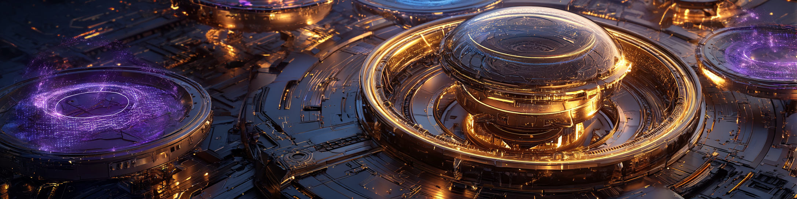

# Servicios de IA



Una colección de servicios de IA útiles para la soberanía de la IA.

[](https://github.com/user-attachments/assets/bc656f0d-6071-4ce4-b66b-e0c447435c66)

## Visión general

Este repositorio contiene un conjunto de servicios de IA containerizados que se pueden ejecutar localmente para brindar diversas capacidades de IA sin depender de proveedores de nube externos. Cada servicio está diseñado para ser fácil de implementar y usar.

## Modelos

Inferencia local de LLM con múltiples backends (vLLM, llama.cpp, SGLang, MLX) y objetivos de hardware (RTX PRO 6000, DGX Spark, AMD Vulkan, Apple Silicon). Cada familia reside bajo `models/<family>/` como un conjunto de archivos `docker-compose.<engine>-<variant>.yml` que sirven una API compatible con OpenAI. Consulta [models/README.md](./models/README.md) para obtener la matriz completa de variantes/benchmarks y un árbol de decisiones de "¿qué variante debo usar?".

### Generación de texto y programación

| Modelo | Descripción | Ubicación |
|-------|-------------|----------|
| **Qwen3.5** | Familia insignia, variantes densas/MoE de 0.8B–122B | [models/qwen3.5](./models/qwen3.5) |
| **Qwen3.6** | Arquitectura híbrida más reciente (Gated DeltaNet + Atención): 27B densos + 35B-A3B MoE | [models/qwen3.6](./models/qwen3.6) |
| **Qwen3-Coder-Next** | Especialista en código MoE de 80B (~3B activos) | [models/qwen3-coder-next](./models/qwen3-coder-next) |
| **Qwopus** | 27B denso destilado para razonamiento tipo Opus | [models/qwopus](./models/qwopus) |
| **GLM-4.7-Flash** | 30B MoE, ~3.6B parámetros activos | [models/glm-4.7-flash](./models/glm-4.7-flash) |
| **Nemotron** | Familia NVIDIA Cascade-2 / Nano, Mamba-2 MoE híbrido (4B–120B) | [models/nemotron](./models/nemotron) |
| **Gemma 4** | Google, Apache 2.0, multimodal (texto/imagen/audio), E2B–31B | [models/gemma4](./models/gemma4) |
| **Carnice-V2-27B** | SFT de agente estilo Hermes basado en Qwen3.6-27B | [models/carnice-v2](./models/carnice-v2) |
| **Mistral Medium 3.5** | 128B denso, multimodal, contexto de 256K | [models/mistral-medium-3.5](./models/mistral-medium-3.5) |

### Especializados

| Modelo | Descripción | Ubicación |
|-------|-------------|----------|
| **Qwen3-Embedding & Reranker** | Bloques de construcción para RAG: APIs de embeddings + reranking/calificación | [models/qwen3-embedding](./models/qwen3-embedding) |
| **Qwen3-ASR** | Voz a texto (52 idiomas) + alineador forzado para marcas de tiempo | [models/qwen3-asr](./models/qwen3-asr) |
| **Qwen3Guard** | Clasificador de seguridad generativo (Seguro/Controversial/Inseguro, 119 idiomas) | [models/qwen3guard](./models/qwen3guard) |
| **DeepSeek-OCR** | Vision-LM, documentos → tablas markdown / HTML / LaTeX | [models/deepseek-ocr](./models/deepseek-ocr) |

Los scripts de prueba y benchmark compartidos se encuentran en [models/shared](./models/shared).

## Servicios de Voz

| Servicio | Descripción | Ubicación | Puerto |
|---------|-------------|----------|------|
| **Whisper** | Voz a texto usando OpenAI Whisper | [speech/whisper](./speech/whisper) | 8000 |
| **Faster Whisper** | Variante optimizada de Whisper | [speech/faster-whisper](./speech/faster-whisper) | — |
| **Orpheus TTS** | Síntesis de voz de alta calidad | [speech/orpheus](./speech/orpheus) | 5005 |

## Servicios de Imagen

| Servicio | Descripción | Ubicación | Puerto |
|---------|-------------|----------|------|
| **open-genmoji** | Generación de emojis personalizados (Flux.1[dev] + LoRA, FP8 en Blackwell) | [open-genmoji](./open-genmoji) | 8888 |

## Monitorización

| Servicio | Descripción | Ubicación | Puerto |
|---------|-------------|----------|------|
| **Panel de GPU** | Grafana + Prometheus + nvidia_gpu_exporter para métricas de GPU | [gpu-dashboard](./gpu-dashboard) | 3000 (Grafana), 9090 (Prometheus), 9835 (exporter) |
| **Netdata** | Monitorización en tiempo real del sistema y la GPU con métricas NVIDIA detectadas automáticamente | [netdata](./netdata) | 19999 |

## Interfaz de Chat

| Servicio | Descripción | Ubicación | Puerto |
|---------|-------------|----------|------|
| **LibreChat** | Interfaz web de chat conectada a los backends de inferencia locales (compatible con OpenAI) | [librechat](./librechat) | 3080 |

## Otros Servicios

### Ollama

Un servidor que ejecuta modelos de lenguaje grande (LLM) localmente con soporte de aceleración por GPU.

- **Características**: Soporta varios modelos de código abierto, acceso a API
- **Ubicación**: [ollama](./ollama)
- **Puerto**: 11434

### Aplicación de Demo (Asistente de Chat de Voz)

Un asistente de voz en tiempo real que integra WebRTC, Whisper, Gemma 3 y Orpheus para chat de voz de extremo a extremo.

- **Ubicación**: [demoapp](./demoapp)
- **Puerto**: 7860

## Primeros Pasos

Cada servicio tiene su propio README.md con instrucciones de configuración específicas y ejemplos de uso. Generalmente, puedes iniciar cada servicio utilizando:

```bash
cd service_directory
docker compose up -d
```

## Agradecimientos y Créditos

¡Este proyecto no habría sido posible sin las grandes contribuciones de muchas personas que se esfuerzan constantemente por la comunidad de código abierto!

- https://canopylabs.ai/
- https://github.com/Lex-au/Orpheus-FastAPI
- https://github.com/richardr1126/LlamaCpp-Orpheus-FastAPI
- https://github.com/freddyaboulton/fastrtc
- https://huggingface.co/
- https://ollama.com/
- https://www.gradio.app/
- https://www.langchain.com/

## Requisitos del Sistema

- Docker y Docker Compose
- GPU NVIDIA con soporte para CUDA (recomendado para un rendimiento óptimo)
- Espacio en disco suficiente para el almacenamiento de modelos

## Licencia

Consulta el archivo [LICENSE](./LICENSE) para más detalles.
